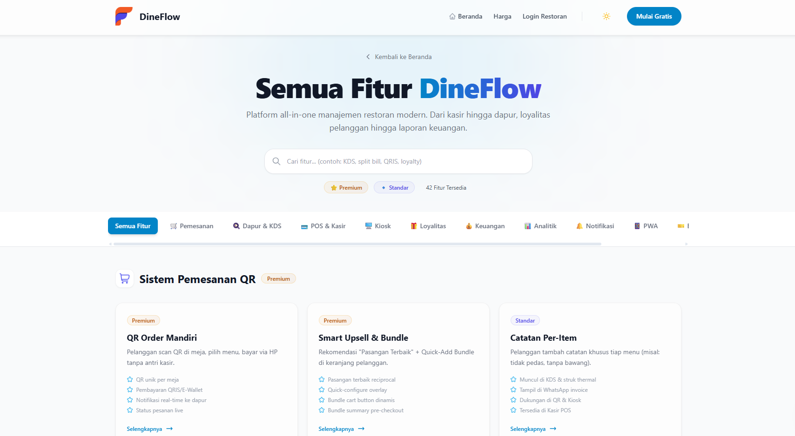

# 🍽️ Dineflo v2 - Advanced Restaurant POS & Management System

**Dineflo** is a comprehensive, multi-tenant restaurant management system designed for scalability and ease of use. From digital menus to real-time kitchen management, Dineflo covers every aspect of modern restaurant operations.

---

## ✨ Key Features

For a comprehensive deep dive into the **46+ advanced features** and detailed system architecture, please refer to our [**Dineflo Project Overview & Feature Guide**](PROJECT_OVERVIEW.md).

### 🏢 Multi-Tenancy Architecture
- **Isolated Tenants:** Each restaurant operates in its own secure environment.
- **Role-Based Access (RBAC):** Granular permissions for Super Admins, Restaurant Owners, and Staff.
- **Tenant Auto-Scoping:** Secure data isolation using Global Eloquent Scopes.

### 💳 POS & Ordering System
- **Digital Menu:** Beautiful, responsive customer-facing menu with QR code integration.
- **Hybrid Real-time Notifications:** Support for **Laravel Reverb** (VPS) and **Pusher** (Shared Hosting) for instant notifications.
- **Waiter Call System:** Real-time table-to-staff notifications via WebSockets.
- **Advanced Cart:** Support for variants, add-ons, and upsells.
- **EDC Payment Integration:** Native support for physical bank terminals with MDR fee tracking and reconciliation.
- **Flexible Payments:** Integrated with Midtrans for seamless online transactions.
- **Draggable & Customizable Dashboard:** Personalize widget layouts per-user with an interactive drag-and-drop interface.
- **Intelligent Lead Chatbot:** WhatsApp-style automated bot with real-time "typing" realism and seamless CRM integration.

### 🍳 Operational Management
- **Kitchen Display System (KDS):** Real-time order monitoring for kitchen efficiency.
- **Inventory Tracking:** Manage ingredients and stock movements automatically.
- **Loyalty Program:** Tiered loyalty points (Silver, Gold) to increase customer retention.
- **Manual Menu Reordering:** Easily organize menu categories and items using a simple drag-and-drop handles.
- **Marketing Tools:** Integrated Email and WhatsApp campaign management.

### 💎 Premium Branding & Events
- **Wedding & Event Packages:** Dedicated premium detail pages for wedding packages with gallery management and capacity tracking.
- **Restaurant Facilities & Gallery:** Showcase your venue's unique amenities (VIP rooms, live music, etc.) with immersive photo galleries.
- **SEO-Friendly Microsite:** Enhance discoverability for major events and banquet services.
- **Smart Chatbot Integration:** Real-time AI-powered lead generation with WhatsApp-style UI and automated data capture. [**View Chatbot Guide**](DOCS_CHATBOT.md)

### 🔐 Robust License Protection & Security
- **Security Ambiguity:** Enhanced password reset flow to prevent user enumeration.
- **Remote Verification:** Centralized license management via 3Flo LicenseHub.
- **Security:** HMAC-SHA256 digital signatures for all server responses.
- **Grace Period:** 7-day operational safety net if a license expires.
- **Auto-Sync:** Background heartbeat pings keep the system status updated.

---

## 🛠️ Tech Stack & Infrastructure

Dineflo is built on a modern, high-performance stack designed for stability and rapid scalability.

| Layer | Technologies |
| :--- | :--- |
| **Backend** |   |
| **Admin Panel** |   |
| **Real-time** |   |
| **Database** |   |
| **Frontend** |   |
| **Deployment** |   |
| **Tools** |   |

---

## 🚀 Quick Start & Installation

Dineflo is designed for easy setup on both local and production environments. For step-by-step instructions tailored to your environment, please refer to the dedicated guides below:

### 🏠 [Localhost Installation (Development)](LOCALHOST_INSTALLATION.md)
Detailed guide for setting up Dineflo on a local machine using **Laragon**, **XAMPP**, or other local servers including:
*   Project cloning and dependency installation (`composer`, `npm`).
*   Development asset compilation (`npm run dev`).
*   Local activation and web-based installer steps.
*   **Automatic Restaurant Trial:** New restaurants automatically receive a complimentary trial package upon registration.

### 🌐 [Production Deployment Guide](DEPLOYMENT_INSTALLATION.md)
Essential steps for deploying Dineflo to a production server, including:
*   Server requirements (PHP 8.2+, MySQL 8, SSL).
*   Correct file permissions and production asset building (`npm run build`).
*   Configuring cron jobs for the scheduler and Supervisord for **Reverb/WebSockets**.
*   Production-ready security practices.

### 🧙‍♂️ Smart Installation Wizard
Dineflo now features an intelligent web-based installer that simplifies deployment:
*   **Auto-Environment:** Automatically detects and sets `APP_TIMEZONE` (Default: UTC).
*   **Real-time Auto-config:** Dynamically generates **Laravel Reverb** (WebSocket) settings based on your `APP_URL`.
*   **Auto-VAPID Generation:** Automatically generates **Web Push Notification** keys (`VAPID_PUBLIC_KEY` / `PRIVATE_KEY`) for out-of-the-box PWA notifications.
*   **Self-Starting Engine:** Automatically attempts to start the **Reverb Server** in the background upon completion (on VPS/Linux environments using `nohup`).

---

---

## 📅 Maintenance & Commands

| Command | Description |
| :--- | :--- |
| `php artisan license:ping` | Manually sync license status with server. |
| `php artisan license:send-warnings` | Send expiration emails to customers (runs daily). |
| `php artisan dineflo:sync-permissions` | Sync & update permissions to all restaurant roles. |
| `php artisan schedule:work` | Start the local scheduler for background tasks. |
| `php artisan optimize:clear` | Clear all system caches. |

---

## 🏗️ Folder Structure (Key Locations)

- `app/Models/`: Core business logic and database entities.
- `app/Filament/`: Admin, HQ, and Restaurant dashboard configurations.
- `app/Livewire/`: Interactive frontend components (Menu, Cart).
- `app/Services/`: Third-party integrations (LicenseHub, Midtrans).
- `resources/views/`: Blade templates and email designs.

---

## 📞 Support & Branding
Created with ❤️ by **3Flo Team**.
For technical support, contact us at [support@3flo.net](mailto:support@3flo.net) or visit [3flo.net](https://3flo.net).

---
© 2026 3Flo.net. All rights reserved.
